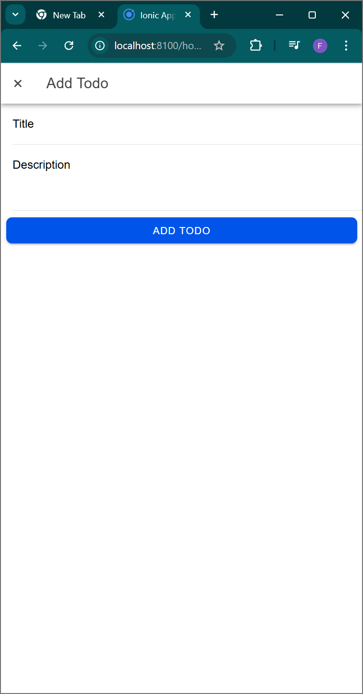
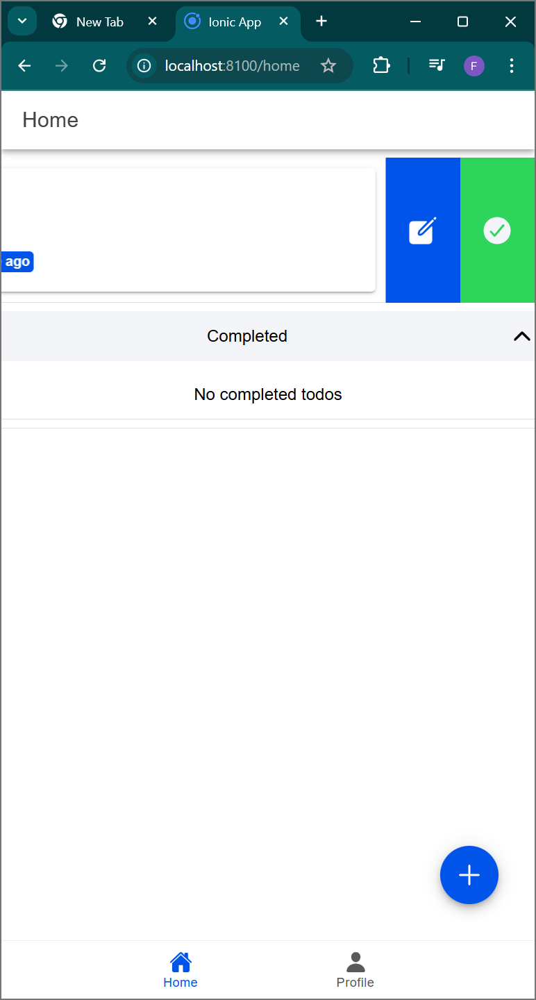
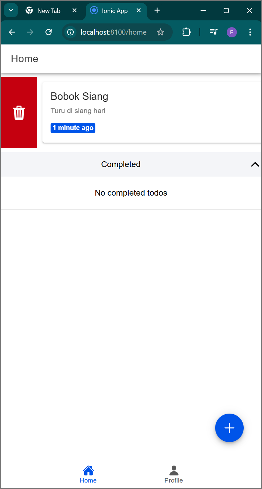
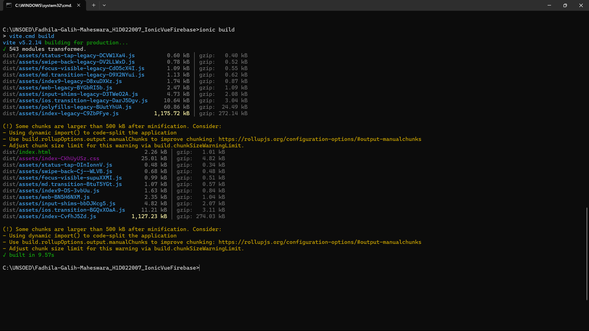

# Fadhila-Galih-Maheswara_H1D022007_IonicVueFirebase
Praktikum Pemrograman Mobile - Tugas 9 (Pertemuan 10) Ionic Vue Firebase

## Vue Firebase Authentification

Nama        : Fadhila Galih Maheswara
NIM         : H1D022007
Shift Lama  : D
Shift Baru  : D

## Langkah-Langkah Implementasi
### 1. Melakukan Inisialisasi Firebase
Inisialisasi Firebase dengan menggunakan konfigurasi yang sesuai di `src/utils/firebase.ts`:
- Konfigurasi Firebase SDK.
- Inisialisasi aplikasi Firebase.
- Setup layanan autentifikasi.

### 2. Membuat Store utuk Autentifikasi
Membuat store menggunakan Pinia pada `src/stores/auth.ts` untuk:
- Mengelola status autentifikasi pengguna.
- Menyimpan data user.
- Menangani proses Login dan Logout.

### 3. Implementasi Login Component
Implementasikan fitur login di `src/views/LoginPage.vue`:
- Tambahkan tombol login Google
- Hubungkan dengan fungsi `loginWithGoogle`
- Tangani callback setelah login berhasil

### 4. Menampilkan Data Pengguna
Akses dan tampilkan data pengguna di `src/views/ProfilePage.vue`:
- Username
- Foto profil
- Informasi akun lainnya

## Note
Pastikan untuk mengganti `YOUR_CLIENT_ID` dengan ID klien Google yang valid dari project Firebase Anda.

## Teknologi yang Digunakan
- Vue.js
- Firebase Authentication
- Pinia State Management
- TypeScript

# Screenshot

  
  
  
  

# Tugas 10

### Halaman Login

Halaman ini menampilkan opsi login menggunakan akun Google. Setelah berhasil login, pengguna akan diarahkan ke halaman Home.

### Halaman Home (CRUD)

Halaman utama aplikasi yang menampilkan daftar todo dan implementasi CRUD:

### Create:

- Tambah todo baru melalui tombol floating action button (+)
- Input judul dan deskripsi todo
- Todo baru akan muncul di daftar aktif

### Read:

- Menampilkan daftar todo aktif dan yang sudah selesai
- Todo ditampilkan dengan judul, deskripsi, dan waktu terakhir diperbarui
- Terdapat fitur refresh untuk memperbarui daftar

### Update:

- Edit todo dengan menggeser item ke kiri dan klik ikon edit
- Ubah status todo (selesai/aktif) dengan menggeser ke kanan
- Perubahan langsung tercermin di daftar

### Delete:

- Hapus todo dengan menggeser item ke kiri
- Konfirmasi penghapusan melalui ikon tempat sampah
- Item terhapus akan hilang dari daftar

### Halaman Profile

Menampilkan informasi pengguna yang sedang login termasuk foto profil dan email, serta tombol untuk logout dari aplikasi.

# Build Project Ionic ke bentuk APK

## Konfigurasi Project
### ionic build

Perintah ini akan membuild project Ionic kita menjadi file statis yang siap dideploy. Proses ini mengkompilasi semua kode TypeScript, Vue components, dan asset lainnya menjadi bundle yang optimal.

## Install dependencies
### npm install @capacitor/android
Menginstall package Capacitor untuk Android yang diperlukan untuk mengkonversi aplikasi web kita menjadi aplikasi native Android. Package ini menyediakan bridge antara kode web dan native Android.

## Build aplikasi
### npm run build
Membuild aplikasi Vue.js untuk production. Proses ini mengoptimasi semua asset dan kode untuk performa terbaik. Output akan disimpan di folder `dist/`.

## Add Android platform
### npx cap add android
Menambahkan platform Android ke project Capacitor. Ini akan membuat folder `android/` yang berisi semua file yang diperlukan untuk project Android native, termasuk struktur project Android Studio.

## Copy web assets
### npx cap copy
Menyalin semua file web yang telah di-build (dari folder `dist/`) ke dalam project Android native. Ini memastikan aplikasi web kita terintegrasi dengan benar ke dalam container native.

## Sync project
### npx cap sync android
Mensinkronkan semua perubahan, termasuk:
- Plugin yang diinstall
- Konfigurasi Capacitor
- Web assets
- Dependencies native
Proses ini memastikan project Android memiliki semua komponen yang diperlukan.

## Open Project di Android Studio