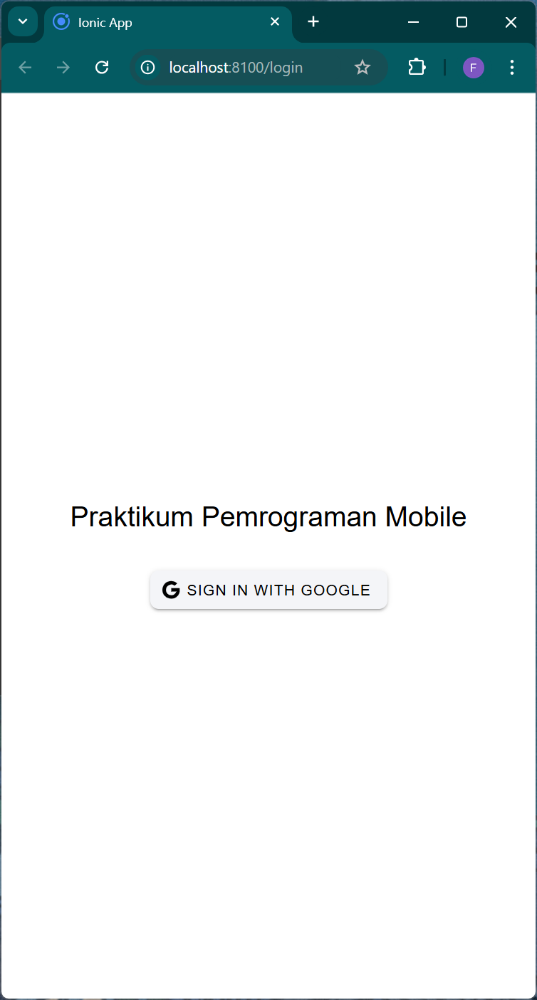
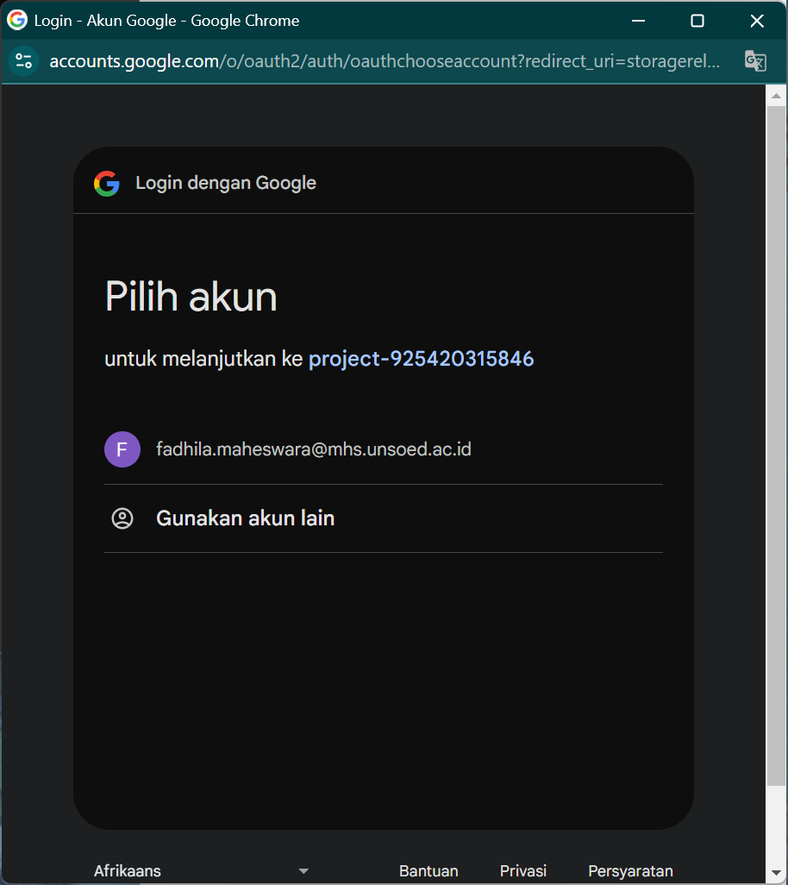
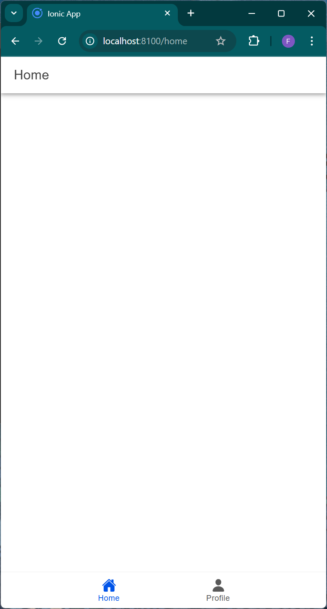
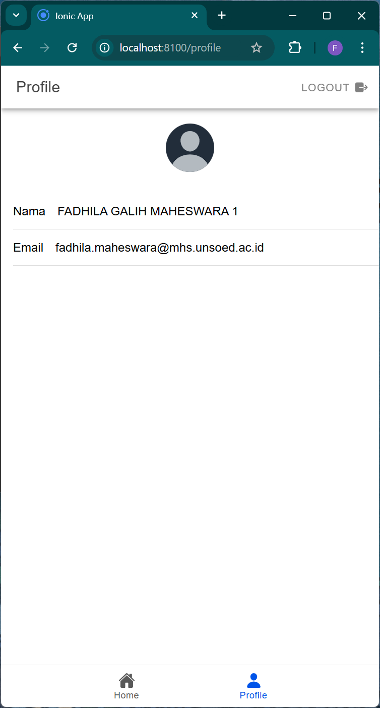

# Fadhila-Galih-Maheswara_H1D022007_IonicVueFirebase
Praktikum Pemrograman Mobile - Tugas 9 (Pertemuan 10) Ionic Vue Firebase

## Vue Firebase Authentification

Nama        : Fadhila Galih Maheswara
NIM         : H1D022007
Shift Lama  : D
Shift Baru  : D

## Langkah-Langkah Implementasi
### 1. Melakukan Inisialisasi Firebase
Inisialisasi Firebase dengan menggunakan konfigurasi yang sesuai di `src/utils/firebase.ts`:
- Konfigurasi Firebase SDK.
- Inisialisasi aplikasi Firebase.
- Setup layanan autentifikasi.

### 2. Membuat Store utuk Autentifikasi
Membuat store menggunakan Pinia pada `src/stores/auth.ts` untuk:
- Mengelola status autentifikasi pengguna.
- Menyimpan data user.
- Menangani proses Login dan Logout.

### 3. Implementasi Login Component
Implementasikan fitur login di `src/views/LoginPage.vue`:
- Tambahkan tombol login Google
- Hubungkan dengan fungsi `loginWithGoogle`
- Tangani callback setelah login berhasil

### 4. Menampilkan Data Pengguna
Akses dan tampilkan data pengguna di `src/views/ProfilePage.vue`:
- Username
- Foto profil
- Informasi akun lainnya

## Note
Pastikan untuk mengganti `YOUR_CLIENT_ID` dengan ID klien Google yang valid dari project Firebase Anda.

## Teknologi yang Digunakan
- Vue.js
- Firebase Authentication
- Pinia State Management
- TypeScript

# Screenshot

  
  
  
  

